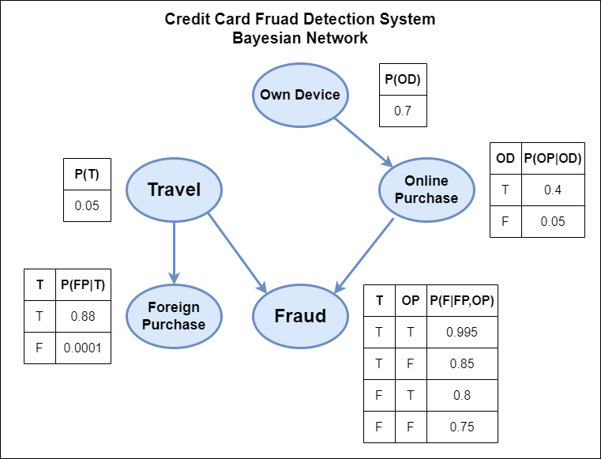

# CS561 Assignment 1
This assignment is a combined work by:
1. Akshat Mittal (200101011, m.akshat@iitg.ac.in)
2. Dhananjai (200101029, dhananjai@iitg.ac.in)

## Exercise 1: Bayesian Networks
### Part A
- According to description given in question and assumptions made as mentioned in report, we have following Bayesian Network and conditional probability tables:



- The corresponding code can be found in `Exercise_1_Part_A.ipynb` file that uses `Python 3.11.8` version.
- Make sure to install `Pomegranate` package before executing the code.
```
pip install pomegranate
```

### Part B
- This part implements `Variable Elimination` and `Gibbs Sampling` from scratch.
- The corresponding code can be found in `Exercise_1_Part_B.ipynb` file.
- Make sure to provide network and CPTs in the correct dictionary form as follows:
```
network = {
    "Variable 1": ["Parent 1", "Parent 2"],
    "Variable 2": []    // No Parents
}

cpt = {
    "Variable 1": [
        [True Value, False Value]  // for Par1=T, Par2=T
        [True Value, False Value]  // for Par1=T, Par2=F
        [True Value, False Value]  // for Par1=F, Par2=T
        [True Value, False Value]  // for Par1=F, Par2=F
    ],
    "Variable 2": [True Value, False Value] // No Parents case
}
```
- <b>Note:</b> Follow the same order of parents in network and CPTs, else code may not provide correct results.

## Exercise 2: Metropolis Hastings Algorithm
- This exercise implement `Metropolis Hastings Algorithm`, a MCMC method of sampling.
- The corresponding code can be found in `Exercise_2.ipynb` file.
- 3 different values of sigma are used for normal distribution:
```
sigma = 0.05    // Low Samples
sigma = 1       // Medium Samples
sigma = 50      // High Samples
```
- The algorithm has been implemented and plots are drawn as required for different values of sigma.
- All conclusions drawn are mentioned in the report along with obtained plots.
- I have taken some reference from [https://blog.djnavarro.net/posts/2023-04-12_metropolis-hastings/](https://blog.djnavarro.net/posts/2023-04-12_metropolis-hastings/) for this exercise.